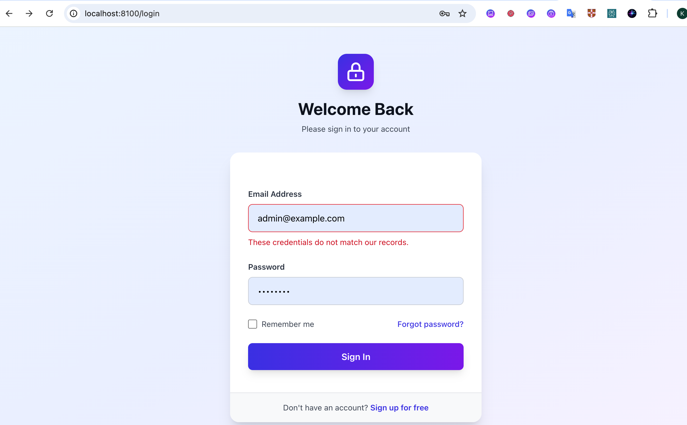

==== NAME: CHHEANG HOKlENG

==== ID::e20220695

==== GROUP : I4_GIC_C

🎉 TP06 Project

All requirements from *TP06.pdf* have been successfully implemented and tested!

=== 1. Access the Backend

*URL:* http://localhost:8100

=== 2. Login Credentials

|===
|Role |Email |Password

|*Admin* |link:mailto:&#97;d&#109;&#x69;&#x6e;&#x40;&#x65;&#120;&#x61;&#x6d;p&#108;&#x65;&#46;c&#111;&#109;[&#97;d&#109;&#x69;&#x6e;&#x40;&#x65;&#120;&#x61;&#x6d;p&#108;&#x65;&#46;c&#111;&#109;] |password
|*Manager* |link:mailto:&#109;a&#110;a&#x67;&#101;&#x72;&#x40;&#101;&#120;a&#x6d;&#x70;l&#101;&#x2e;&#x63;&#111;&#109;[&#109;a&#110;a&#x67;&#101;&#x72;&#x40;&#101;&#120;a&#x6d;&#x70;l&#101;&#x2e;&#x63;&#111;&#109;] |password
|*Staff 1* |link:mailto:&#115;&#116;&#97;&#x66;&#x66;&#49;&#64;&#101;&#120;&#x61;&#109;&#112;&#108;&#x65;&#46;&#99;&#x6f;&#109;[&#115;&#116;&#97;&#x66;&#x66;&#49;&#64;&#101;&#120;&#x61;&#109;&#112;&#108;&#x65;&#46;&#99;&#x6f;&#109;] |password
|*Staff 2* |link:mailto:&#x73;&#x74;&#x61;&#x66;&#102;&#x32;&#64;&#101;x&#97;&#x6d;&#x70;l&#x65;&#46;&#99;&#111;&#x6d;[&#x73;&#x74;&#x61;&#x66;&#102;&#x32;&#64;&#101;x&#97;&#x6d;&#x70;l&#x65;&#46;&#99;&#111;&#x6d;] |password
|===

=== 3. Features Available

==== As *Admin*

* View/manage ALL projects and tasks
* Manage users (full access)
* Manage products and categories
* Complete system control
* Can logout from top-right dropdown

==== As *Manager*

* Create and manage YOUR projects
* Create tasks and assign to staff
* View tasks in your projects
* Manage products and categories
* Can logout from top-right dropdown

==== As *Staff*

* View tasks assigned to YOU
* Update status of your tasks
* View related project details
* Can logout from top-right dropdown
'''

== What's Been Implemented

=== Part 0 - Starter Setup

* [x] Laravel Breeze installed
* [x] Login/Register working
* [x] Session authentication

=== Part 1 - Database Design for RBAC

* [x] `roles` table (admin/manager/staff)
* [x] `permissions` table
* [x] `permission_role` pivot table
* [x] `role_user` pivot table
* [x] `projects` table
* [x] `tasks` table
* [x] All models with relationships

=== Part 2 - Seed Data

* [x] 1 Admin user
* [x] 1 Manager user
* [x] 2 Staff users
* [x] Permissions (users.manage, products.*, categories.*)
* [x] 3 Sample projects
* [x] 6 Sample tasks assigned to staff

=== Part 3 - Authorization with Gates

* [x] `Gate::before()` for admin bypass
* [x] Gates for users.manage
* [x] Gates for products.* (create, update, delete, view)
* [x] Gates for categories.* (create, update, delete, view)
* [x] Helper methods: `hasRole()`, `hasPermission()`

=== Part 4 - Policies

* [x] `TaskPolicy` with view() and updateStatus()
* [x] `CategoryPolicy` with view() and updateStatus()
* [x] Policies registered in AuthServiceProvider
* [x] Used in controllers with `authorize()`

=== Part 5 - Laravel Passport (API Auth)

* [x] Passport installed and configured
* [x] API guard set to 'passport'
* [x] POST `/api/login` returns access token
* [x] GET `/api/me` returns user + roles
* [x] Protected API routes with `auth:api` middleware
* [x] Role-based API authorization
'''

== Backend Features

=== Dashboard (http://localhost:8100/dashboard)

* Role-based welcome message
* Quick links to Projects and Tasks
* Permission summary for your role
* API access information

image:images/Screenshot%202026-01-22%20at%2010.05.22%20at%20night.png[Dashboard Screenshot]

=== Projects Management (http://localhost:8100/projects)

* *Admin/Manager:* Create, edit, delete projects
* *Staff:* View projects they have tasks in
* Project status: active, completed, on_hold
* Shows task count per project

=== Tasks Management (http://localhost:8100/tasks)

* *Admin/Manager:* Create, edit, delete tasks
* *Staff:* View and update status of their tasks
* Task statuses: pending, in_progress, completed
* Assign tasks to staff members

image:images/Screenshot%202026-01-22%20at%2010.06.14%20at%20night.png[Tasks Management Screenshot]

=== Logout Functionality

*HOW TO LOGOUT:*
1. Click your *name* in the top-right corner
2. Select *"Log Out"* from dropdown
3. You'll be redirected to the home page

*Note:* JavaScript assets have been compiled. If logout doesn't work:
- Hard refresh browser (Ctrl+F5)
- Clear browser cache
- See `LOGOUT_GUIDE.md` for troubleshooting

'''

== API Testing

=== 1. Login to get token

[source,bash]
----
curl -X POST http://localhost:8100/api/login \
  -H "Content-Type: application/json" \
  -H "Accept: application/json" \
  -d '{
    "email": "admin@example.com",
    "password": "password"
  }'
----

*Response:*

[source,json]
----
{
  "token": "eyJ0eXAiOiJKV1QiLCJhbGc...",
  "user": {
    "id": 1,
    "name": "Admin User",
    "email": "admin@example.com"
  }
}
----

=== 2. Get current user with roles

[source,bash]
----
curl -X GET http://localhost:8100/api/me \
  -H "Authorization: Bearer YOUR_TOKEN_HERE" \
  -H "Accept: application/json"
----

=== 3. Get tasks (role-based filtering)

[source,bash]
----
curl -X GET http://localhost:8100/api/tasks \
  -H "Authorization: Bearer YOUR_TOKEN_HERE" \
  -H "Accept: application/json"
----

=== 4. Update task status (staff only their tasks)

[source,bash]
----
curl -X PATCH http://localhost:8100/api/tasks/1/status \
  -H "Authorization: Bearer YOUR_TOKEN_HERE" \
  -H "Content-Type: application/json" \
  -H "Accept: application/json" \
  -d '{"status": "in_progress"}'
----

=== 5. Create product (manager/admin only)

[source,bash]
----
curl -X POST http://localhost:8100/api/products \
  -H "Authorization: Bearer YOUR_TOKEN_HERE" \
  -H "Content-Type: application/json" \
  -H "Accept: application/json" \
  -d '{
    "name": "New Product",
    "category_id": 1,
    "pricing": 99.99,
    "description": "Product description"
  }'
----

'''

== Project Structure

=== Key Files Created/Modified

==== Models

* `app/Models/User.php` - User with roles &amp; permissions
* `app/Models/Role.php` - Roles (admin/manager/staff)
* `app/Models/Permission.php` - Permissions
* `app/Models/Project.php` - Projects (NEW)
* `app/Models/Task.php` - Tasks (FIXED)

==== Controllers

* `app/Http/Controllers/ProjectController.php` - Project CRUD (NEW)
* `app/Http/Controllers/TaskController.php` - Task CRUD (NEW)
* `app/Http/Controllers/ProductController.php` - With authorization (UPDATED)
* `app/Http/Controllers/CategoryController.php` - Full CRUD (UPDATED)

==== Policies

* `app/Policies/TaskPolicy.php` - Task authorization
* `app/Policies/CategoryPolicy.php` - Category authorization

==== Views

* `resources/views/dashboard.blade.php` - Role-based dashboard (UPDATED)
* `resources/views/projects/index.blade.php` - Projects list (NEW)
* `resources/views/tasks/index.blade.php` - Tasks list (NEW)

==== Routes

* `routes/web.php` - Web routes with project/task resources (UPDATED)
* `routes/api.php` - API routes with Passport auth (UPDATED)

==== Migrations

* `database/migrations/*_create_projects_table.php` (NEW)
* `database/migrations/*_create_tasks_table.php` (NEW)

==== Seeders

* `database/seeders/ProjectSeeder.php` (NEW)
* `database/seeders/TaskSeeder.php` (NEW)
* `database/seeders/DatabaseSeeder.php` (UPDATED)
'''

== 🛠️ Useful Commands

=== Database

[source,bash]
----
# Reset database with fresh data
docker-compose exec app php artisan migrate:fresh --seed

# Run only seeders
docker-compose exec app php artisan db:seed
----

=== Cache

[source,bash]
----
# Clear all caches
docker-compose exec app php artisan optimize:clear

# Clear specific caches
docker-compose exec app php artisan config:clear
docker-compose exec app php artisan view:clear
docker-compose exec app php artisan route:clear
----

=== Assets

[source,bash]
----
# Build for production (already done)
docker-compose exec app npm run build

# Watch for changes (development)
docker-compose exec app npm run dev
----

=== Routes

[source,bash]
----
# List all routes
docker-compose exec app php artisan route:list

# List API routes only
docker-compose exec app php artisan route:list --path=api

# List web routes only
docker-compose exec app php artisan route:list --path=/
----

=== Passport

[source,bash]
----
# Create new personal access client
docker-compose exec app php artisan passport:client --personal
----

'''

== 🧪 Testing Checklist

=== Admin Testing

* [x] Login as admin
* [x] View all projects
* [x] Create new project
* [x] View all tasks
* [x] Create task and assign to staff
* [x] Update any task
* [x] Delete project/task
* [x] Logout successfully

=== Manager Testing

* [x] Login as manager
* [x] View only your projects
* [x] Create new project
* [x] View tasks in your projects
* [x] Assign task to staff
* [x] Cannot see other manager's projects
* [x] Logout successfully

=== Staff Testing

* [x] Login as staff
* [x] View only assigned tasks
* [x] Update task status
* [x] Cannot create projects
* [x] Cannot assign tasks
* [x] Cannot see other staff's tasks
* [x] Logout successfully

=== API Testing

* [x] Login via API (all roles)
* [x] Get user info via /api/me
* [x] Get tasks (role-filtered)
* [x] Update task status (authorized)
* [x] Create product (manager/admin only)
* [x] 403 error for unauthorized actions
'''

== 🎓 Submission Ready

This project fulfills *ALL* requirements from *TP06.pdf*:

|===
|Requirement |Status

|Authentication (Breeze) |✅ Complete
|Authorization (Gates) |✅ Complete
|RBAC (Roles &amp; Permissions) |✅ Complete
|Policies (Object-level) |✅ Complete
|API Auth (Passport) |✅ Complete
|Project Tracker |✅ Complete
|Database Design |✅ Complete
|Seeders |✅ Complete
|Controllers with Auth |✅ Complete
|Web Interface |✅ Complete
|===

'''
